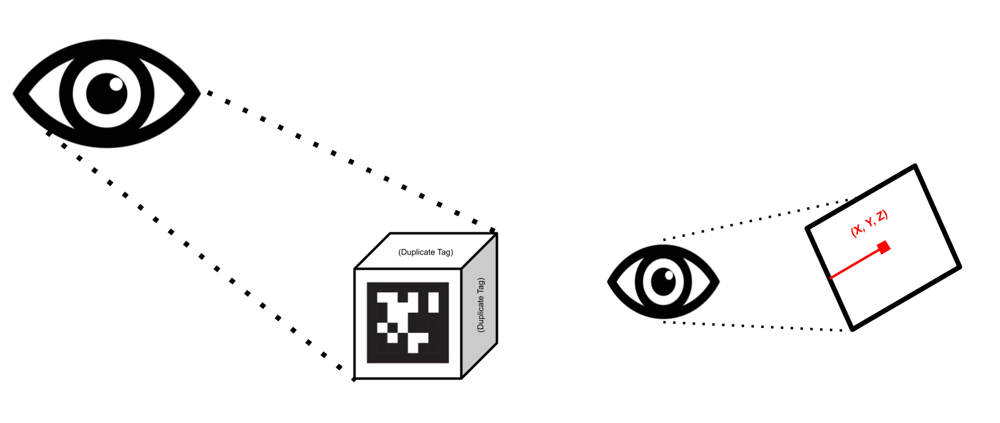
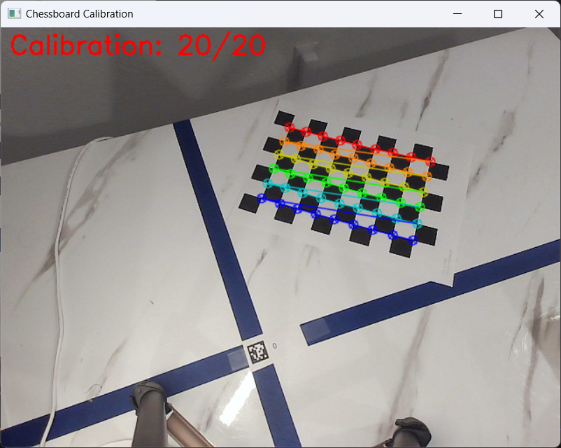
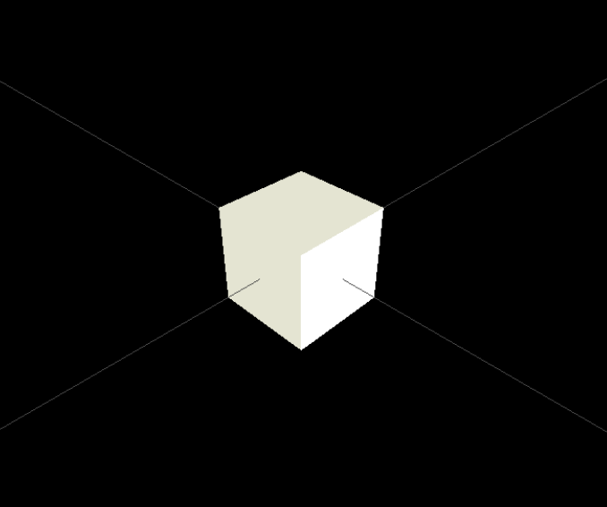
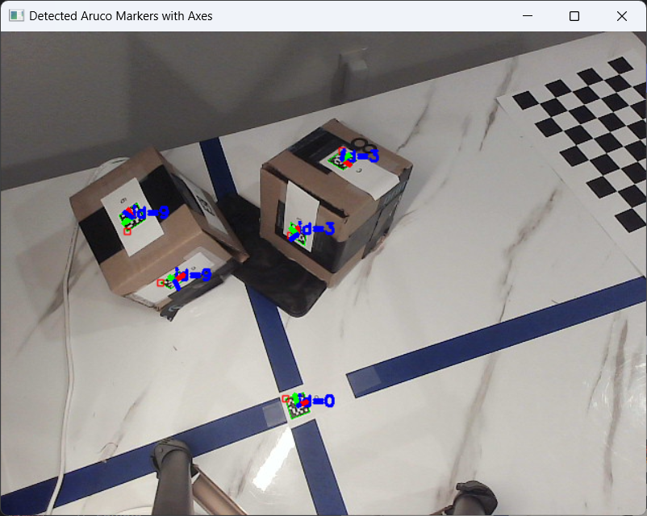

# 6DoF ArUco Tag Detection and Visualizer

By: Michael Gross

## Overview

With the introduction of computer vision into modern robotics, the need to detect objects and track their rotational and translational pose is very important if robots are to interact with them.

Additionally, this project has large implications to transfer into the world of real-time digital twins and agnostic controller designs.

## Running the Code

### Calibration Sequence

In order to run this code, setup a camera in a fixed position. For the following experiments, I used a webcam on tripod.

The calibration is required whenever the camera is newly installed or whenever a file does not exist already. In order to calibrate, simply run the main code by typing [`python Main_CV2.py`](Main_CV2.py)` in the terminal and the calibration window will automatically pop up.

The calibration sequence in the code is defaulted to a 9x6 chessboard printout which can be found at the OpenCV page. Other options include various sizes and charuco boards as well.

## Mesh Generation

Using an authored [`tag_MetaData.json`](ArucoTag/MeshGeneration/tag_MetaData.json) file, the user can specify the object associated with each ID and the dimensions/orientations therein. The generated stl files are subsequently generated automatically as generic representations if an stl is not supplied manually.

Below, you can see the generated [`Box_ID9.stl`](ArucoTag/MeshGeneration/STL_files/Box_ID9.stl) for the Aruco ID9 tag.

Applications for this include the ability to generate real time digital twin objects with mirrored pose and position.

## Real Time Detection and Object Pose Definition

Using OpenCV's library and built in methods, this code is able to detect ArUco Tags, display the object internalized axis, and publish the 6DoF pose: `(x, y, z) & (roll, pitch, yaw)`. It should be noted that this is in the frame of the camera and is currently pixel-based. The image below shows the project in an earlier stage demonstrating a per-marker axis plotting.

